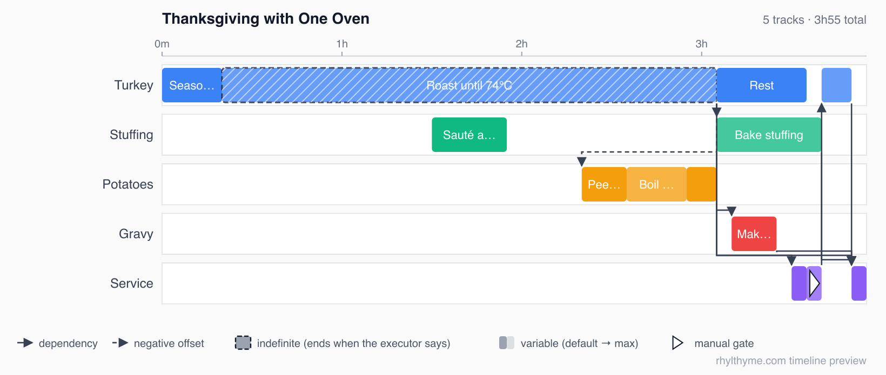

# @rhylthyme/timeline

Timing engine and static Gantt renderer for [Rhylthyme](https://www.rhylthyme.com)
programs. Zero dependencies, one UMD file, runs in the browser, Node and ESM.

A Rhylthyme program is JSON describing parallel **tracks** of sequential
**steps**, each with a duration (fixed, variable or indefinite) and a start
trigger (program start, an offset, after another step's end or start,
after with buffer, manual, on abort, or all/any of several). This package
turns that into resolved start and end times and draws them:



Rows are tracks and bars are steps at their resolved times. The roast is
*indefinite* (hatched): it ends when the cook says so, and everything after
it is planned against its default duration. Arrows are cross-track
dependencies; the dashed one is a negative offset ("peel the potatoes
45 min before the roast is due out"). The flag on "Guests seated" is a
*manual* gate; "Serve" waits for all four dishes. The oven has capacity
one, so the stuffing bakes only after the turkey comes out.

## Quickstart

Reproduce that picture in under a minute:

```bash
git clone https://github.com/rhylthyme/rhylthyme-timeline
cd rhylthyme-timeline
node examples/render.js test/fixtures/programs/thanksgiving_one_oven.json thanksgiving.svg
```

The script prints every step's resolved start and end and writes the SVG.
For a PNG, `npm i @resvg/resvg-js` and give the output a `.png` name (or
run any SVG converter, e.g. `rsvg-convert -w 1640 -f png -o out.png thanksgiving.svg`).
Point it at your own program JSON to render that instead; the
[example corpus](test/fixtures/programs) has 39 more.

In a page, without a build step:

```html
<script src="https://cdn.jsdelivr.net/npm/@rhylthyme/timeline@1/src/index.js"></script>
<div id="timeline"></div>
<script>
  Rhylthyme.renderTimeline(document.getElementById('timeline'), program);
</script>
```

```js
// Node / bundlers
const Rhylthyme = require('@rhylthyme/timeline');
const timings = Rhylthyme.computeStepTimings(program);
const svg = Rhylthyme.renderTimelineSvg(program);
```

## API

| Function | Returns |
|---|---|
| `computeStepTimings(program)` | `{ [stepId]: { start, end, duration, trackId, resolved } }` in seconds from program start. `resolved` is `false` when a trigger could not be satisfied (cycle or dangling reference); such steps are placed at `t = 0`. |
| `renderTimelineSvg(program, opts?)` | SVG markup (string). `opts = { arrows, marks, legend }`, all default `true`: cross-track dependency arrows (dashed for negative offsets), hatched indefinite steps, faded variable-step extensions to their maximum, a flag on manual gates, and a one-line legend. |
| `renderTimeline(container, program, opts?)` | Injects the SVG into a DOM element and returns the markup. |
| `parseSeconds(value)` | `90`, `"90"`, `"5m"`, `"1h30m"`, `"-20m"` → seconds (number). |
| `stepDurationSeconds(step)` | Planning duration: fixed seconds, else variable default, else max, else min; indefinite → `defaultSeconds` or 0. |
| `version` | Package version string. |
| `supportedSchemaVersions` | Program schema versions this engine understands. |

### Trigger semantics

Timings follow the Python reference validator in
[`rhylthyme`](https://github.com/rhylthyme/rhylthyme-cli-runner):

| Trigger | Start |
|---|---|
| `programStart` | 0 (+ `offsetSeconds` if given) |
| `programStartOffset` | `offsetSeconds` |
| `afterStep` | referenced step's end (or start with `event: "start"`) + `offsetSeconds`; a negative offset is clamped so the step never begins before the referenced step |
| `afterStepWithBuffer` | referenced end + `bufferSeconds` + `offsetSeconds` |
| `onAbort` | referenced end (placeholder; fires only on abort at run time) |
| `manual` | end of the previous step in the same track |
| `{ logic: "all" \| "any", triggers: [...] }` | max / min of the sub-triggers |

Offsets and durations accept numbers (seconds) or unit strings.

## Versioning

SemVer. The exported function signatures are the public API; changing one
is a major release. Adding support for a new program-schema version is a
minor release and is recorded in `supportedSchemaVersions`. Rendering
changes that keep the SVG structure are patch releases.

`test/fixtures/python-timings.json` holds start/end times for the example
corpus computed by the Python reference validator; `npm test` asserts this
engine agrees with it, so the two implementations cannot drift silently.

### Known differences from the Python validator

The parity test excludes programs that use these constructs; each is a
documented disagreement to be resolved on one side or the other:

| Construct | Python validator | This engine |
|---|---|---|
| `afterStepWithBuffer` | ignores `bufferSeconds` | adds it |
| negative `offsetSeconds` | places the step at the referenced step's start (placeholder) | `ref.end + offset`, clamped to `ref.start` |
| `replicates` / `batch_size` | expands them before resolving | resolves the unexpanded program |

## Related

- [rhylthyme-spec](https://github.com/rhylthyme/rhylthyme-spec): the JSON Schema
- [rhylthyme-examples](https://github.com/rhylthyme/rhylthyme-examples): the programs used as test fixtures
- The interactive player (`<rhylthyme-timeline>` Web Component) is planned as a second entry point of this package; see the roadmap in the server repository's `plans/rhylthyme-timeline.md`.

## License

Apache-2.0.
