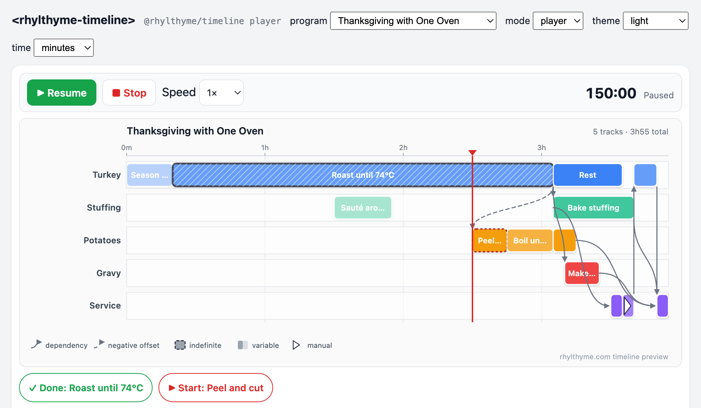
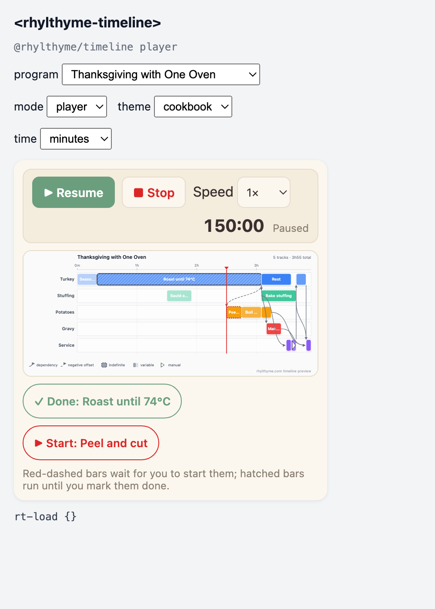
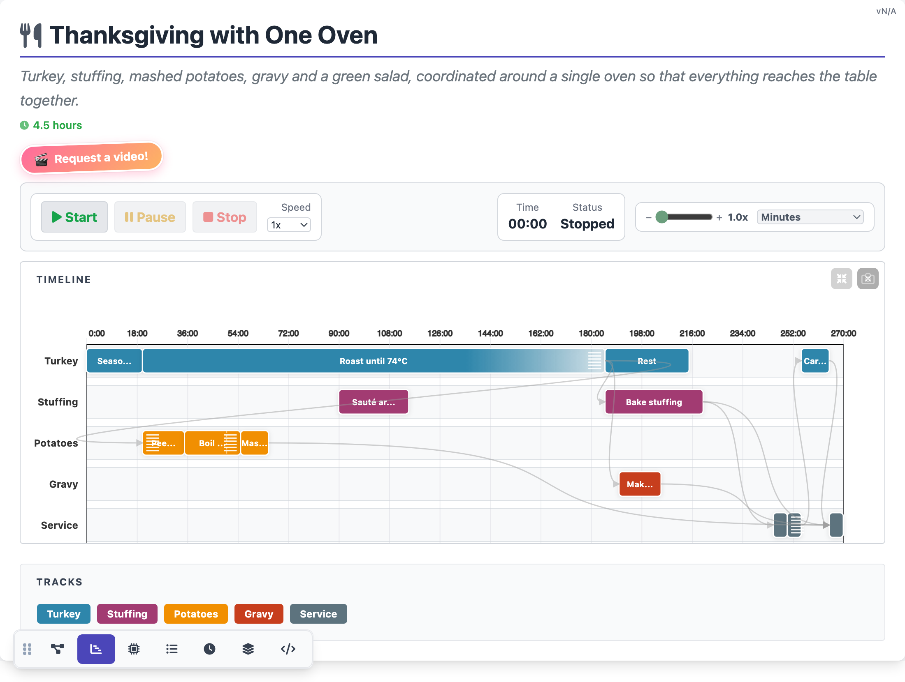
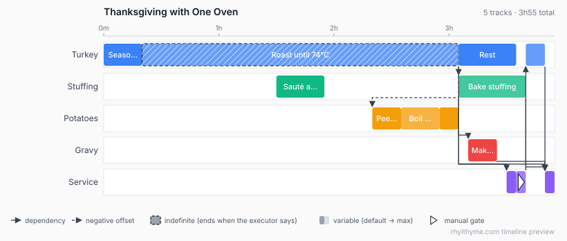

# @rhylthyme/timeline

Timing engine, static Gantt renderer and `<rhylthyme-timeline>` player
Web Component for [Rhylthyme](https://www.rhylthyme.com) programs. Zero
dependencies; the engine is one UMD file that runs in the browser, Node and ESM.

A Rhylthyme program is JSON describing parallel **tracks** of sequential
**steps**, each with a duration (fixed, variable or indefinite) and a start
trigger (program start, an offset, after another step's end or start,
after with buffer, manual, on abort, or all/any of several). This package
turns that into resolved start and end times and draws them.

## What it produces

Four outputs from the same engine, shown here for
[`thanksgiving_one_oven.json`](test/fixtures/programs/thanksgiving_one_oven.json).

### 1. The `<rhylthyme-timeline>` element (2.0 beta)

A Web Component that plays a program: wall-clock-anchored cursor, Start /
Pause / Stop, speed, manual gates and indefinite steps handled by the
person following along, and events for the host page. Timings come from
the engine (`computeStepTimings(program, { actual, now })`), so what the
player shows is what the validator plans, adjusted for what has actually
happened.



```html
<script src="https://cdn.jsdelivr.net/npm/@rhylthyme/timeline@2/src/index.js"></script>
<script src="https://cdn.jsdelivr.net/npm/@rhylthyme/timeline@2/src/element.js"></script>

<rhylthyme-timeline src="thanksgiving.json" mode="player" speed="1" time-format="minutes"></rhylthyme-timeline>
<script>
  const el = document.querySelector('rhylthyme-timeline');
  // or: el.program = programObject;
  el.addEventListener('rt-step-start', (e) => console.log('started', e.detail.stepId, 'at', e.detail.time));
  el.addEventListener('rt-complete', () => console.log('all done'));
</script>
```

Try it: `open examples/player.html` (program, mode, theme and time-format
pickers, event log). `?at=9000&theme=dark` positions it for screenshots.

| Attribute | Values |
|---|---|
| `program` (property) / `src` | program object, or a URL to fetch |
| `mode` | `player` (default) or `static` (the Gantt alone, no controls or cursor) |
| `speed` | playback multiplier, default `1` |
| `time-format` | `minutes` (`mm:ss`), `seconds`, `hours` (`h:mm:ss`), `clock` (wall time from `start-at` or the moment Start was pressed) |
| `start-at` | ISO 8601 start time for `clock` format |
| `theme` | `light`, `dark`, `cookbook`; or override `--rt-bg`, `--rt-fg`, `--rt-accent`, `--rt-border`, `--rt-panel`, `--rt-muted` |
| `view` | `timeline` (itinerary and DAG views are planned) |

Methods: `start()`, `pause()`, `stop()`, `toggle()`, `seek(seconds)` (while
paused), `startStep(id)`, `completeStep(id)`, `tick()`, `setClock(fn)`.
Read-only: `currentTime`, `status`, `timings`, `stepStates`. Events (all
bubble and cross the shadow boundary): `rt-load`, `rt-start`, `rt-pause`,
`rt-stop`, `rt-tick`, `rt-step-start`, `rt-step-complete`, `rt-complete`.

How the player treats step kinds, matching the rhylthyme.com runner:

- **Manual gates** (`startTrigger.type: "manual"`) and **negative-offset
  hand-offs** wait for `startStep()`. Until then they float forward with
  the cursor (shown as a red dashed bar with a *Start* button), and
  everything downstream moves with them.
- **Indefinite steps** run until `completeStep()` (*Done* button).
  Starting a negative-offset step caps the step it refers to at
  now + |offset|, so "peel the potatoes 45 min before the roast is due
  out" ends the roast 45 min after you start peeling.
- **Variable steps with a `triggerName`** can be finished after
  `minSeconds` and finish on their own at `maxSeconds`.
- When every step is done the player pauses after a 3 s grace period with
  status `completed`.



The dark preset inverts the chart with a CSS filter; theming the SVG
itself is on the roadmap. `test/element.test.js` drives the element in
headless Chrome through a full Thanksgiving run with a fake clock (CI has
Chrome; locally it is skipped unless a Chrome binary is found or
`CHROME_BIN` is set).

### 2. The classic player page: `node player/build.js`

The page rhylthyme.com serves in its player: a timeline with a live cursor,
Start / Pause / Stop and speed controls, zoom, and a tab bar for the
itinerary, dependency graph, resources, clock, layers and JSON editor views.
This is a Chrome screenshot of the page `player/build.js` wrote:



```bash
node player/build.js test/fixtures/programs/thanksgiving_one_oven.json thanksgiving-player.html
open thanksgiving-player.html
```

The output is one self-contained HTML file (D3 v5 and Font Awesome load
from CDNs). Pass `--environment env.json` to merge an environment's
resource constraints the way the server does. From code:

```js
const { buildPlayerHtml } = require('@rhylthyme/timeline/player');
const html = buildPlayerHtml(program /*, environment */);
```

`player/template.html` is exported verbatim from the server's
`web_visualizer.py`; `player/build.js` ports the Python that fills its
slots. `npm test` rebuilds every corpus program and checks the HTML is
byte-identical to the server's (39 programs, sha256). Two things to know:
the player keeps the server's own step placement, which puts a
negative-offset step at the start of the step it refers to rather than
where `computeStepTimings` puts it (unifying the two is on the roadmap),
and the "Switch kitchen" button messages a parent window, so it does
nothing when the file is opened on its own.

### 3. The static SVG: `renderTimelineSvg` (Node) and `renderTimeline` (browser)

One Gantt drawing, no dependencies. `renderTimelineSvg(program)` returns
it as an SVG string; `renderTimeline(container, program)` is a two-line
wrapper that calls the same function and sets the container's
`innerHTML` to the result, so what a page shows is exactly this file:



Rows are tracks and bars are steps at their resolved times. The roast is
*indefinite* (hatched): it ends when the cook says so, and everything after
it is planned against its default duration. Arrows are cross-track
dependencies; the dashed one is a negative offset ("peel the potatoes
45 min before the roast is due out"). The flag on "Guests seated" is a
*manual* gate; "Serve" waits for all four dishes. The oven has capacity
one, so the stuffing bakes only after the turkey comes out.

From Node, [`examples/render.js`](examples/render.js) writes the file and
prints every step's resolved start and end:

```bash
node examples/render.js test/fixtures/programs/thanksgiving_one_oven.json thanksgiving.svg
```

```
   0:00 –   20:00  Turkey: Season and truss
  20:00 – 185:00  Turkey: Roast until 74°C
 185:00 – 215:00  Turkey: Rest
 220:00 – 230:00  Turkey: Carve and serve
  90:00 – 115:00  Stuffing: Sauté aromatics, mix
 185:00 – 220:00  Stuffing: Bake stuffing
 140:00 – 155:00  Potatoes: Peel and cut
 155:00 – 175:00  Potatoes: Boil until tender
 175:00 – 185:00  Potatoes: Mash with butter
 190:00 – 205:00  Gravy: Make gravy from drippings
 210:00 – 215:00  Service: Dress the salad
 215:00 – 220:00  Service: Guests seated
 230:00 – 235:00  Service: Serve
wrote thanksgiving.svg
```

For a PNG, `npm i @resvg/resvg-js` and give the output a `.png` name (or
run any SVG converter, e.g. `rsvg-convert -w 1640 -f png -o out.png thanksgiving.svg`).
Point it at your own program JSON to render that instead; the
[example corpus](test/fixtures/programs) has 39 more.

In a browser, open [`examples/index.html`](examples/index.html) (no server
or build needed): it loads `src/index.js`, calls `renderTimeline`, and has
a dropdown of six example programs.

### 4. Just the numbers: `computeStepTimings(program)`

What both renderers are drawn from (seconds from program start;
`resolved` is `false` only for cycles or dangling references):

```js
const R = require('@rhylthyme/timeline');
R.computeStepTimings(program)
// {
//   'turkey-prep':  { start: 0,     end: 1200,  duration: 1200, trackId: 'turkey',   resolved: true },
//   'turkey-roast': { start: 1200,  end: 11100, duration: 9900, trackId: 'turkey',   resolved: true },
//   'potatoes-peel':{ start: 8400,  end: 9300,  duration: 900,  trackId: 'potatoes', resolved: true },  // roast end − 45 min
//   'guests-seated':{ start: 12900, end: 13200, duration: 300,  trackId: 'service',  resolved: true },  // manual gate, planned after the previous step
//   'serve':        { start: 13800, end: 14100, duration: 300,  trackId: 'service',  resolved: true },  // all four dishes done
//   ...
// }
```

## Usage

In a page, without a build step:

```html
<script src="https://cdn.jsdelivr.net/npm/@rhylthyme/timeline@1/src/index.js"></script>
<div id="timeline"></div>
<script>
  Rhylthyme.renderTimeline(document.getElementById('timeline'), program);
</script>
```

```js
// Node / bundlers
const Rhylthyme = require('@rhylthyme/timeline');
const timings = Rhylthyme.computeStepTimings(program);
const svg = Rhylthyme.renderTimelineSvg(program);
```

## API

| Function | Returns |
|---|---|
| `computeStepTimings(program, opts?)` | `{ [stepId]: { start, end, duration, trackId, resolved } }` in seconds from program start. `resolved` is `false` when a trigger could not be satisfied (cycle or dangling reference); such steps are placed at `t = 0`. `opts.actual = { [stepId]: { start?, end? } }` overrides the plan with what actually happened; `opts.now` makes unstarted manual gates float to the current time and started indefinite steps stretch to it. |
| `renderTimelineSvg(program, opts?)` | SVG markup (string). `opts = { arrows, marks, legend }`, all default `true`: cross-track dependency arrows (dashed for negative offsets), hatched indefinite steps, faded variable-step extensions to their maximum, a flag on manual gates, and a one-line legend (dependency, negative offset, indefinite, variable, manual). Player options: `timings` (precomputed), `now` (draws the cursor), `states` (`{ [stepId]: 'done' \| 'active' \| 'waiting' }`), `width`. Bars carry `class="rt-bar"` and `data-step`. |
| `renderTimeline(container, program, opts?)` | Injects the SVG into a DOM element and returns the markup. |
| `buildPlayerHtml(program, environment?)` (from `@rhylthyme/timeline/player`) | The interactive visualizer page as an HTML string, identical to the server's. Needs Node (reads `player/template.html`). |
| `stepNeedsStart(step)` / `stepNeedsFinish(step)` | Whether the executor must start the step (manual gate, negative offset) / must end it (indefinite, variable with `triggerName`). |
| `expandReplicates(program)` | A deep copy with track/step `replicates` (and legacy `batch_size`/`stagger`) expanded into flat tracks and steps, exactly as the Python `expand_replicates` does. The functions above apply it automatically. |
| `parseSeconds(value)` | `90`, `"90"`, `"5m"`, `"1h30m"`, `"-20m"` → seconds (number). |
| `stepDurationSeconds(step)` | Planning duration: fixed seconds, else variable default, else max, else min; indefinite → `defaultSeconds`, or a 60 s placeholder. |
| `version` | Package version string. |
| `supportedSchemaVersions` | Program schema versions this engine understands. |

### Trigger semantics

Timings follow the Python reference validator in
[`rhylthyme`](https://github.com/rhylthyme/rhylthyme-cli-runner):

| Trigger | Start |
|---|---|
| `programStart` | 0 (+ `offsetSeconds` if given) |
| `programStartOffset` | `offsetSeconds` |
| `afterStep` | referenced step's end (or start with `event: "start"`) + `offsetSeconds`; a negative offset is clamped so the step never begins before the referenced step |
| `afterStepWithBuffer` | referenced end + `bufferSeconds` + `offsetSeconds` |
| `onAbort` | referenced end (placeholder; fires only on abort at run time) |
| `manual` | end of the previous step in the same track |
| `{ logic: "all" \| "any", triggers: [...] }` | max / min of the sub-triggers |

Offsets and durations accept numbers (seconds) or unit strings.

## Versioning

SemVer. The exported function signatures are the public API; changing one
is a major release. The element's attributes, methods and events are part
of that API from 2.0.0 onward; while the version is `2.0.0-beta.N` they may
change between betas. Adding support for a new program-schema version is a
minor release and is recorded in `supportedSchemaVersions`. Rendering
changes that keep the SVG structure are patch releases.

`test/fixtures/python-timings.json` holds start/end times for the example
corpus computed by the Python reference validator; `npm test` asserts this
engine agrees with it on every step of every program (616 steps, 39
programs at 1.3.0), so the two implementations cannot drift silently.

## Related

- [rhylthyme-spec](https://github.com/rhylthyme/rhylthyme-spec): the JSON Schema
- [rhylthyme-examples](https://github.com/rhylthyme/rhylthyme-examples): the programs used as test fixtures
- The `<rhylthyme-timeline>` element is pre-release (2.0.0-beta); its attribute and event names may still change. rhylthyme.com serves it behind a flag (`/p/<id>?player=element`) while the classic player (`player/`) remains the default. Roadmap: the server repository's `plans/rhylthyme-timeline.md`.

## License

Apache-2.0.
